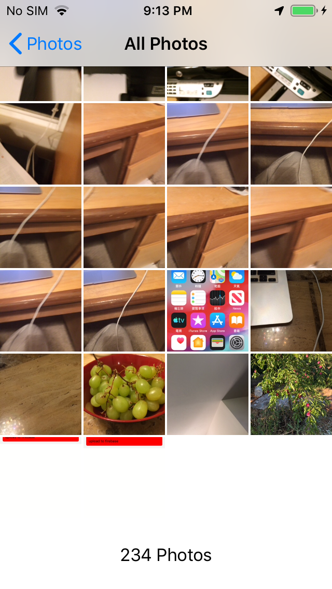
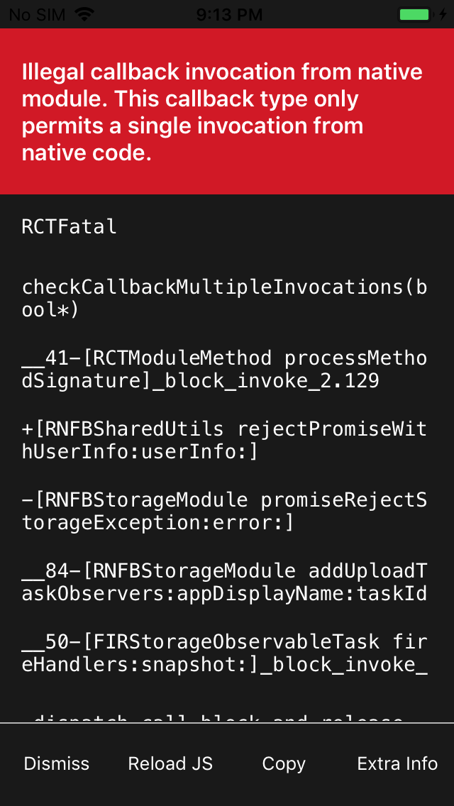

# react-native-firebase-live-photo-bug

### Steps to reproduce error
1. tap 'pick live photo' button. Use image picker to pick a **live** photo.
2. tap 'upload to firebase' button. wait for error

### Screenshots

